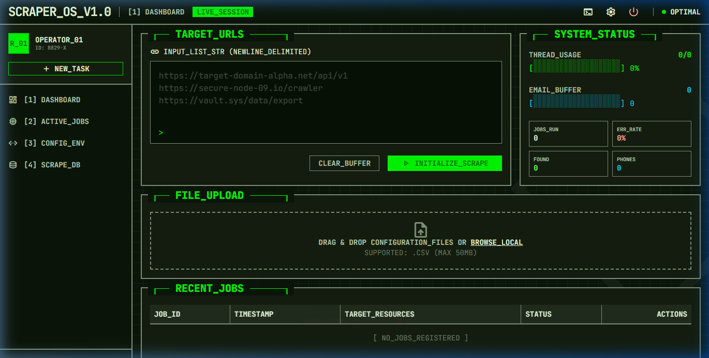
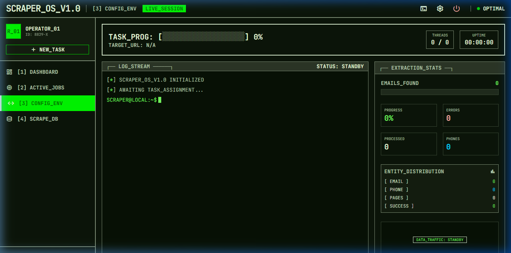
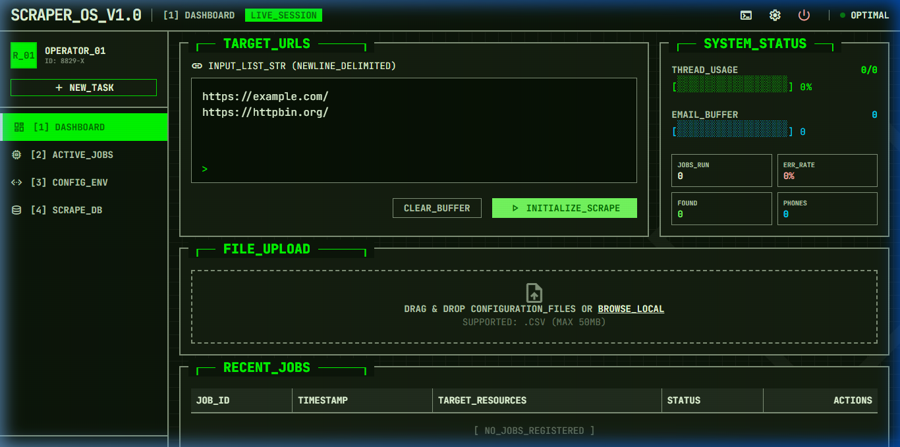
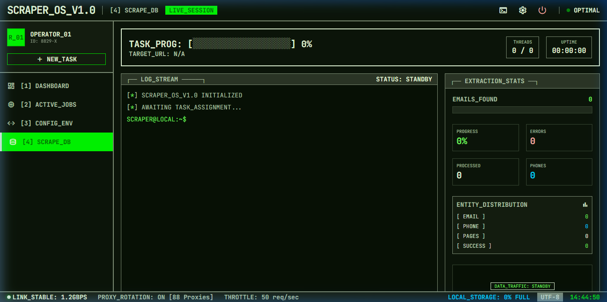
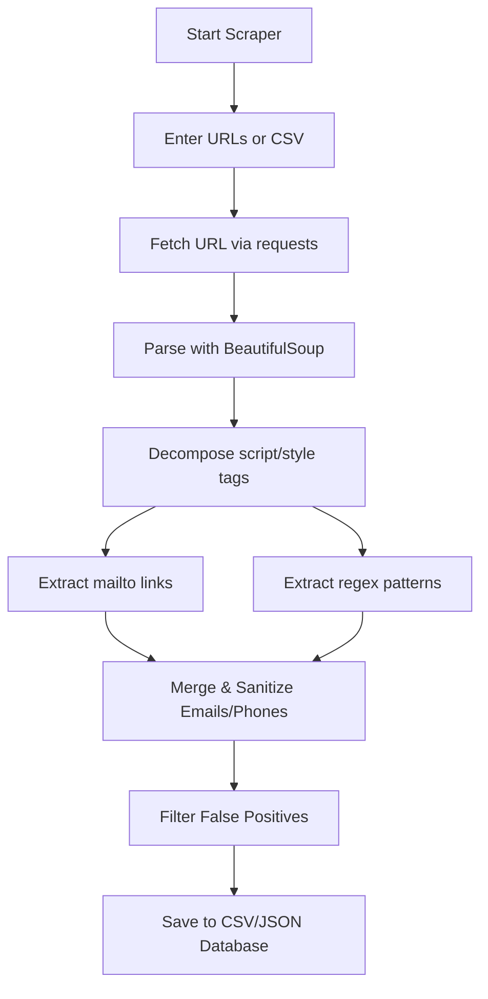

# Email & Lead Web Scraper 📧🕸️

A lightweight, efficient, and robust tool designed to scrape, extract, and clean email addresses and phone numbers from target websites. It features a high-performance Python backend with concurrent processing, a terminal-based CLI, and a stunning cyberpunk/retro web dashboard powered by Flask, TailwindCSS, and Server-Sent Events (SSE).

---

## ✨ Features

### 🔍 Core Scraping Engine
- **Double-Extraction Method**:
  - **Direct `mailto:` Links**: Extracts explicit email links from anchor tags.
  - **Regex Text Harvesting**: Scans body text and full HTML using regular expressions to find text-based addresses.
- **Data Sanitization & Cleaning**:
  - Automatically filters out common false positives (e.g. static assets ending in `.png`, `.jpg`, `.gif`, `.css`, `.js`).
  - Standardizes all email addresses to lowercase and trims extraneous whitespace.
  - Deduplicates addresses within and across multiple sources.

### 🖥️ Cyberpunk Web Dashboard (`SCRAPER_OS_V1.0`)
- **Real-Time Log Streaming**: Live log output via SSE (Server-Sent Events) simulating a vintage terminal.
- **Visual CSV Configuration**: Drag and drop large CSV lists (up to 50MB) and select the target URL column via an interactive spreadsheet preview.
- **Live System Telemetry**: Interactive dials and graphs tracking CPU thread usage, error rate, email buffer size, and speed metrics.
- **Network Adjustments**: Real-time control sliders for request timeouts, crawler concurrency workers, and domain crawl depths.
- **Flexible Database Exports**: Query scraped historical data and download results as deduplicated unique emails, complete source maps, extracted phones, or structured JSON.

---

## 🛠️ Requirements & Installation

This project requires **Python 3.x** and the libraries listed in [requirements.txt](file:///c:/Users/Informatics/OneDrive/Desktop/Claude/lead%20scraping/requirements.txt).

### 1. Install Dependencies
Run the following command in your terminal to install the necessary libraries:
```bash
pip install -r requirements.txt
```

### 2. File Directory
Ensure your folder structure contains:
```text
lead scraping/
├── email_scraper.py        # Core Scraper Logic
├── app.py                  # Flask Web UI Server
├── requirements.txt        # Python Dependencies
├── vercel.json             # Deployment Config
├── README.md               # Project Documentation
├── images/                 # Web UI Screenshots
│   ├── dashboard.png
│   ├── active_jobs.png
│   ├── config_env.png
│   └── scrape_db.png
└── scraper_app/            # Web App Assets
    ├── index.html          # UI Layout
    ├── styles.css          # Vintage Retro Theme Styles
    └── script.js           # Live-update SSE & Interactive State
```

---

## 🚀 How to Use

### Option A: Cyberpunk Web UI (Recommended)
1. Run the Flask server from your terminal:
   ```bash
   python app.py
   ```
2. Open your web browser and navigate to:
   ```text
   http://127.0.0.1:5000
   ```
3. Enter your URLs or upload a CSV file, configure your preferences in the sidebar, and press **INITIALIZE_SCRAPE**.

### Option B: Terminal CLI
1. Run the core script directly:
   ```bash
   python email_scraper.py
   ```
2. Select your desired mode from the prompt:
   - **Interactive Mode**: Input custom URLs one by one at runtime (type `done` to start).
   - **Demo Mode**: Run a quick validation test using default placeholder targets.
3. Locate the generated outputs in the project folder:
   - `scraped_emails.csv`
   - `unique_scraped_emails.csv`

---

## 🖥️ Web UI Dashboard Preview

Here is a look at the retro-futuristic dashboard interface:

### 📊 1. Control Center Dashboard
Configure list-based scraping by pasting multiple URLs directly, viewing active system resource usage, uploading target CSV files, or checking recent job tables.


### ⚙️ 2. Configuration Panel
Easily adjust timeout values, increase concurrent thread workers (from 1 to 200), set deep crawler follow loops, or toggling phone number extractions.


### 🔄 3. Live Log Stream & Progress
Watch logs stream dynamically with vintage CRT animations, tracking real-time status notifications, success/failure counts, and data-entry distributions.


### 🗄️ 4. Local Scrape Database & Downloads
Inspect previous runs and export findings into unique list CSVs, full mapping files, phone directories, or complete telemetry-focused JSON models.


---

## ⚙️ Technical Overview

The backend scraping logic consists of:
1. **Request Emulation**: Includes a `User-Agent` header in requests to mimic a browser, preventing basic bot detection.
2. **DOM Cleanup**: Decomposes `<script>` and `<style>` elements to prevent false matches from Javascript/CSS blocks.
3. **Data Verification**: Splitting domain extensions and inspecting suffix patterns to filter garbage captures.



---

## 📄 License
This project is open-source and free to modify or distribute.

