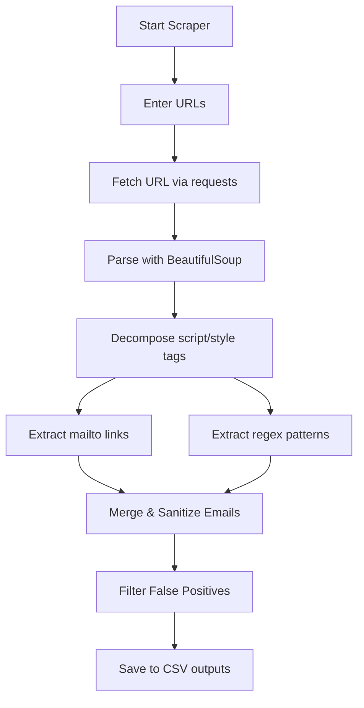

# Email Web Scraper 📧🕸️

A lightweight, efficient, and robust Python script designed to scrape, extract, and clean email addresses from target websites. It features two extraction strategies (direct link harvesting and regex pattern matching), automated cleaning/filtering of false positives, and exports findings to structured CSV files.

---

## ✨ Features

- **Double-Extraction Method**:
  - **Direct `mailto:` Links**: Extracts explicit email links from anchor tags.
  - **Regex Text Harvesting**: Scans body text and full HTML using regular expressions to find text-based addresses.
- **Data Sanitization & Cleaning**:
  - Automatically filters out common false positives (e.g. static assets ending in `.png`, `.jpg`, `.gif`, `.css`, `.js`).
  - Standardizes all email addresses to lowercase and trims extraneous whitespace.
  - Deduplicates addresses within and across multiple sources.
- **Two Flexible Operational Modes**:
  - **Interactive Mode**: Input custom URLs one by one at runtime.
  - **Demo Mode**: Run a quick verification test using default example URLs.
- **Detailed CSV Outputs**:
  - `scraped_emails.csv`: Maps each found email to its source URL.
  - `unique_scraped_emails.csv`: A clean, single-column export containing only unique email addresses.

---

## 🛠️ Requirements & Installation

This project requires **Python 3.x** and two external packages: [Requests](https://requests.readthedocs.io/) and [BeautifulSoup4](https://www.crummy.com/software/BeautifulSoup/).

### 1. Install Dependencies
Run the following command in your terminal to install the necessary libraries:
```bash
pip install requests beautifulsoup4
```

### 2. File Directory
Ensure your folder structure contains:
```text
lead scraping/
├── email_scraper.py
└── README.md
```

---

## 🚀 How to Use

1. Run the script from your terminal:
   ```bash
   python email_scraper.py
   ```

2. Select your desired mode from the prompt:
   - **Option 1**: Enter your target URLs manually (e.g., `https://example.com/contact`). Type `done` when you are finished.
   - **Option 2**: Run the scraper in Demo Mode using standard placeholder targets.

3. Locate the generated outputs in the project folder:
   - `scraped_emails.csv`
   - `unique_scraped_emails.csv`

---

## ⚙️ Technical Overview

The scraping logic consists of:
1. **Request Emulation**: Includes a `User-Agent` header in requests to mimic a browser, preventing basic bot detection.
2. **DOM Cleanup**: Decomposes `<script>` and `<style>` elements to prevent false matches from Javascript/CSS blocks.
3. **Data Verification**: Splitting domain extensions and inspecting suffix patterns to filter garbage captures.



---

## 📄 License
This project is open-source and free to modify or distribute.
